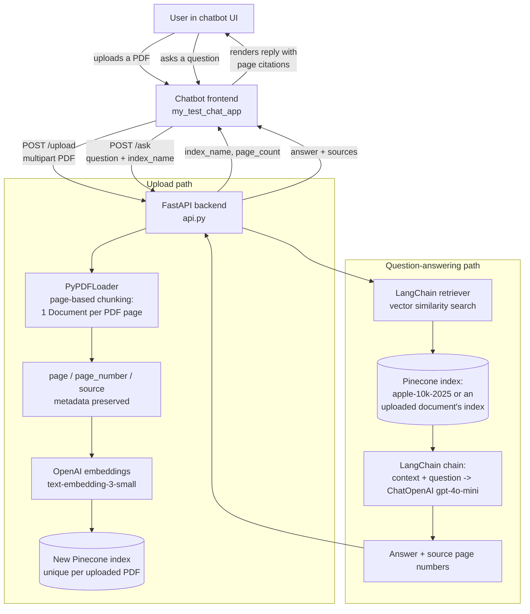

# Apple 10-K RAG (Pinecone + LangChain + FastAPI)

A retrieval-augmented QA app over Apple's 2025 Form 10-K filing, plus a
FastAPI backend that lets any chatbot upload an arbitrary PDF, ingest it
page-by-page into its own Pinecone index, and ask questions about it. Every
PDF — the bundled Apple 10-K or a new upload — is loaded as one LangChain
`Document` per page (page-based chunking, no further splitting), embedded,
and stored in Pinecone with page metadata preserved.

## Architecture



The Apple 10-K homework flow (`ingest.py` / `query.py`) and the generic
upload flow (`api.py`) share the same ingestion and retrieval code in
`rag_core.py`, so they behave identically with respect to chunking and
answer format — they just target different Pinecone indexes.

## Files

- `rag_core.py` — shared LangChain/Pinecone logic: page-based PDF loading,
  index creation, embedding, upsert, retriever + RAG chain construction, and
  a safe/unique Pinecone index-name generator. Used by all three entry
  points below.
- `ingest.py` — CLI: loads `data/_10-K-2025-As-Filed.pdf` page-by-page and
  upserts it into the `apple-10k-2025` Pinecone index.
- `query.py` — CLI: builds a retriever + RAG chain over `apple-10k-2025` and
  answers questions, citing source page number(s).
- `api.py` — FastAPI backend exposing `/upload` and `/ask` (see below) so an
  external chatbot can ingest and query arbitrary PDFs over HTTP.
- `requirements.txt` — Python dependencies.
- `.env.example` — required environment variable names (no real values).

## Setup

1. Create a virtual environment and install dependencies:
   ```bash
   python3 -m venv .venv
   source .venv/bin/activate
   pip install -r requirements.txt
   ```
2. Copy `.env.example` to `.env` and fill in your real API keys:
   ```bash
   cp .env.example .env
   ```
   You'll need:
   - `PINECONE_API_KEY` — from the [Pinecone console](https://app.pinecone.io)
   - `OPENAI_API_KEY` — from the [OpenAI platform](https://platform.openai.com)

## Run — Apple 10-K homework CLI

1. Ingest the PDF into Pinecone (creates the index on first run):
   ```bash
   python ingest.py
   ```
2. Ask questions:
   ```bash
   python query.py
   ```
   This runs the two required questions by default:
   - "Can you tell me Apple revenue by products and services?"
   - "Where is Apple headquarters?"

   Or ask your own question:
   ```bash
   python query.py "What was Apple's total net sales in fiscal 2025?"
   ```

## Run — FastAPI backend

Start the API server (defaults to `http://localhost:8000`):
```bash
uvicorn api:app --reload --port 8000
```

### `GET /health`
Liveness check, returns `{"status": "ok"}`.

### `POST /upload`
`multipart/form-data` with a `file` field (PDF only, 25 MB max). Ingests the
PDF page-by-page into a brand-new Pinecone index and returns:
```json
{
  "index_name": "quarterly-report-3f9a2b1c",
  "filename": "quarterly-report.pdf",
  "page_count": 42
}
```

### `POST /ask`
JSON body:
```json
{ "question": "Where is the company headquartered?", "index_name": "quarterly-report-3f9a2b1c" }
```
`index_name` is optional and defaults to `apple-10k-2025`, so the homework
questions work against the bundled Apple 10-K without passing it. Returns:
```json
{
  "answer": "The company is headquartered in ...",
  "sources": [{ "page_number": 4, "source": "quarterly-report.pdf" }]
}
```

## Chatbot integration

The Next.js chatbot at `my_test_chat_app` proxies to this API through two
of its own server routes (`app/api/rag/upload` and `app/api/rag/ask`), so
the browser never talks to this backend directly. See that project's
`ARCHITECTURE.md` for the chat-side flow. Existing Gemini chat functionality
in that app is unaffected — RAG is an additive path, selected per
conversation once a PDF has been uploaded.

## How page-based chunking works

`PyPDFLoader` (from `langchain-community`) returns one `Document` per PDF
page out of the box, with `metadata["page"]` (0-indexed) set automatically.
`rag_core.load_pages` adds `metadata["page_number"]` (1-indexed) and
`metadata["source"]` for readability, then `rag_core.ingest_pdf` upserts each
page as its own vector — no `RecursiveCharacterTextSplitter` or other
sub-page splitting is used, per the assignment's page-based chunking
requirement. This applies identically whether the PDF is the bundled Apple
10-K or a document uploaded through `/upload`.

## Unique Pinecone index names for uploads

`rag_core.make_index_name` slugifies the uploaded filename (lowercased,
non-alphanumeric characters collapsed to hyphens, truncated) and appends an
8-character random hex suffix, capped at Pinecone's 45-character index-name
limit — e.g. `quarterly-report-3f9a2b1c`. This keeps names readable, valid,
and collision-free across repeated uploads of files with the same name.
