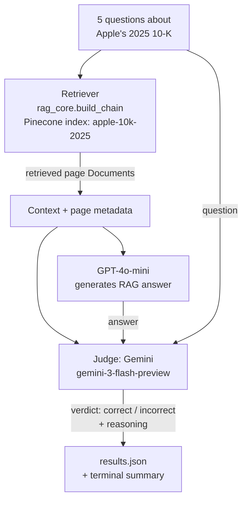

# Week 6 — Evaluate RAG Responses Using LLM-as-Judge

## Objective

Evaluate the quality of the existing Apple 2025 10-K RAG system by having a
**second, independent LLM** act as a judge: for each question, it reviews
the retrieved context and the RAG-generated answer, then gives a verdict of
exactly `correct` or `incorrect`. This checks the answer's factual grounding
in the retrieved pages, not just whether it "sounds right."

## Architecture / Workflow



This script does **not** re-implement ingestion or retrieval — it imports
`build_chain` directly from the project's `rag_core.py`, the same module
used by `ingest.py`, `query.py`, and `api.py`. So the retriever, the
Pinecone index (`apple-10k-2025`), the embedding model
(`text-embedding-3-small`), and the answer-generation model (`gpt-4o-mini`)
are all identical to the rest of the project — nothing about the existing
RAG pipeline was changed for this homework.

The only new piece is the **judge call**: a second LangChain chain, using
`ChatGoogleGenerativeAI` (Gemini) instead of `ChatOpenAI`, so the model
grading the answer is never the same model that produced it.

## What is LLM-as-a-Judge?

LLM-as-a-Judge is an evaluation technique where, instead of (or alongside)
human review, a capable LLM is prompted to assess the quality of another
model's output against stated criteria. Here, the judge is given:

- the **question** asked,
- the **retrieved context** (the exact page content the RAG system had
  available when it answered), and
- the **generated answer** to evaluate,

and is instructed to judge the answer strictly against that context —
i.e., "is this answer actually supported by what was retrieved, and does it
correctly answer the question?" — rather than against the judge's own
background knowledge. Using a *different* model as judge (Gemini judging
GPT-4o-mini) reduces the risk of a model being systematically biased toward
its own answer style or blind spots.

## Models used

| Role | Model | Why |
|---|---|---|
| Embeddings | `text-embedding-3-small` (OpenAI) | Reused unchanged from `rag_core.py`. |
| RAG answer generation | `gpt-4o-mini` (OpenAI) | Reused unchanged from `rag_core.py`. |
| Judge | `gemini-3-flash-preview` (Google, via `langchain-google-genai`) | A different provider than the RAG model, so the judge isn't grading its own homework. |

## Setup

This reuses the project's existing `.env` (`pinecone_rag_homework/.env`) —
no new `.env` file is created. In addition to the existing
`PINECONE_API_KEY` / `OPENAI_API_KEY`, add one line for the judge model:
```
GOOGLE_API_KEY=<your Gemini API key>
```
(This can be the same key already used as `GOOGLE_GENAI_API_KEY` in the
separate `my_test_chat_app/.env.local` project.)

Install the one new dependency (`langchain-google-genai`) alongside the
project's existing `requirements.txt`:
```bash
cd pinecone_rag_homework
source .venv/bin/activate
pip install -r requirements.txt
```

## How to run

From the `pinecone_rag_homework` directory (the Apple 10-K index must
already be ingested via `python ingest.py`, as in the main homework):
```bash
python week6_llm_judge/evaluate_rag.py
```

The script will, for each of the 5 questions:
1. retrieve relevant pages from the `apple-10k-2025` Pinecone index,
2. generate an answer with GPT-4o-mini,
3. send the question, retrieved context, and answer to Gemini for judging,
4. print a running log, then a full summary table to the terminal.

All 5 full records (question, answer, source pages, judge model, verdict,
and judge reasoning) are saved to [`results.json`](./results.json).

## Output format

Each entry in `results.json`:
```json
{
  "question": "...",
  "rag_model": "gpt-4o-mini",
  "rag_answer": "...",
  "sources": [{ "page_number": 7, "source": "_10-K-2025-As-Filed.pdf" }],
  "judge_model": "gemini-3-flash-preview",
  "judge_reasoning": "...",
  "verdict": "correct"
}
```
